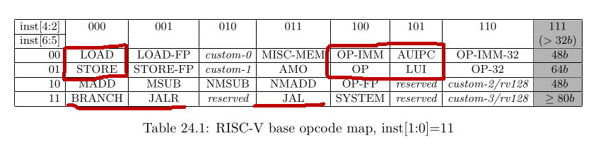

# RS selection

## Overview

This block is responsible for selection an entry in RS and insert there instruction. Additionally it has to inform
proper wakeup logic block about this insertion.

## Example internal data

In the simplest case we can select RS using instruction opcode routing. As described in chapter 24 of RiscV unprivileged
architecture there is possible to split instruction into parts based on bits [6:2]. So I would like to use such
splitting.

Let `R_tab` will be routing table with 32 entries. Each entry is indexed by bits [6:2] from the instruction and in the
entry there is stored identifier of FU (or set of FU-s) to which this instruction should be route (if this will be
needed there is possibility to add hierarchical routing). `R_tab` will be ROM generated before amaranth elaboration.

## Methods

### Route new instruction

Choose FU to which instruction should be send (e.g. based on `opcode_maj` and `R_tab`) reserve position in RS for these
FU and insert this instruction to RS and wakeup logic.

Ready when:
- *implementation defined*

Input:
- `opcode_maj` - major instruction identifier
- `opcode_min` - minor instruction identifier for FU
- `id_rs1` - id of RF field where `src1` should be stored
- `id_rs2` - id of RF field where `src2` should be stored
- `id_out` - id of RF field where instruction output should be stored
- `id_ROB` - id of ROB entry which is allocated for this instruction
- `imm` - immediate
- `start` - signal to start operation

Output:
- *null*

Side effects:
- If instruction cannot be routed (e.g. it has wrong opcodes) report it
- Execute ["Insert new instruction"](../shared_structs/RS.md#insert-new-instruction) in RS
- Execute ["Insert new instruction"](../execute/wakeup.md#insert-new-instruction) in wakeup logic

Remarks:
- It can be useful to use ["Get slot and mark as used"](../shared_structs/RS.md#get-slot-and-mark-as-used) from RS
